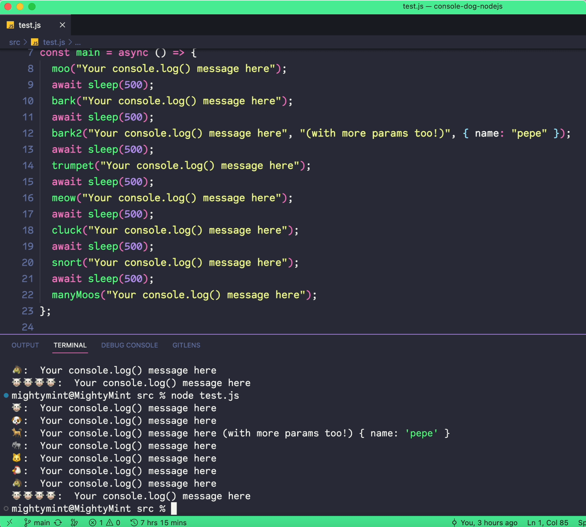

# Console Dog for Node.js 🐶

Improve your dev experience by adding a bunch of animal sounds to any event you want to log.

If you're working on a node.js project, both your native terminal and the VS Code terminal will play the animal sounds for you, and of course, keep console-logging everything passed to the functions.

## The motivation:

We believe that will make you more productive and efficient.
Your coworkers and people around will probably hate your guts forever,
but the truth is that with sounds, you will be aware when and what type of special events happened without having to go read your terminal.

**Tip**: don't over use it! Keep it in special cases, as an extra debugging tool. Give it a try and send sounds of your pet in a PR if you want (PR now goes for `pet request`)


## Demo Video 🎥

[](https://javitoshi.com/videos/console-dog-demo.mp4)

Click on the thumbnail above to watch the video demo of Console Dog in action.

## Installation 📦

```bash
npm install console-dog-nodejs
```

## Usage 🚀

Using Console Dog is simple! Just import the library and use one of the available functions to log your message with sound.

```js
const { bark, meow } = require("console-dog-nodejs");

bark("Who let the dogs out?");
meow("Just a curious cat!");
```

### Available Sounds

- `bark(...args: any[]): void` - A dog barks 🐶
- `bark2(...args: any[]): void` - A dog barks 🐕
- `cluck(...args: any[]): void` - A chicken clucks 🐔
- `longMeow(...args: any[]): void` - One of the longest meows ever 🐈
- `manyMoos(...args: any[]): void` - Many cows moo 🐮🐮🐮🐮
- `meow(...args: any[]): void` - A cat meows 🐱
- `mew(...args: any[]): void` - A cat mews 🐱
- `moo(...args: any[]): void` - A cow moos 🐮
- `snort(...args: any[]): void` - A pig snorts 🐷
- `trumpet(...args: any[]): void` - An elephant trumpets 🐘

If you have any questions or feedback, please feel free to [open an issue](https://github.com/JaviEzpeleta/console-dog-nodejs/issues)


